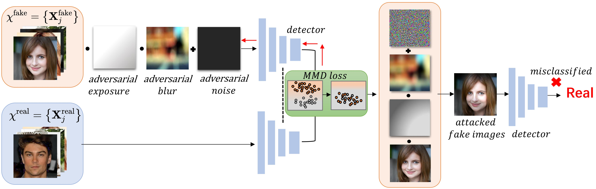

# Evadingfakedetector
We propose a statistical consistency attack (StatAttack) against diverse DeepFake detectors.

# Requirements
- numpy==1.24.1
- opencv_python==4.8.0.76
- Pillow==10.0.0
- scikit_learn==1.3.0
- scipy==1.11.1
- torch==2.0.1+cu118
- torchattacks==3.4.0
- torchvision==0.15.2+cu118
- umap==0.1.1

# DataSet
we conduct a comprehensive evaluation based on 4 generation methods. The generated face dataset includes entire face synthesis images, face identity swap images, and face manipulation images
- StyleGANv2: https://github.com/NVlabs/stylegan2
- StarGAN: https://github.com/yunjey/stargan
- ProGAN: https://github.com/tkarras/progressive_growing_of_gans
- FaceForensics++: https://github.com/ondyari/FaceForensics

# Usage
1. Clone this repository and install the required modules as listed in `requirements.txt`.
2. Place the detection model code in the `model` directory. Follow the `resnet50` example inside the `model` folder to add hooks for obtaining the mmd loss.
3. Run `demo.py` to generate adversarial samples.

